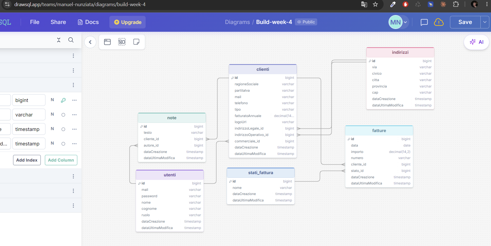

# EPIC SUN ENERGY — Gestionale Clienti & Fatture

API REST per la gestione di **clienti**, **indirizzi**, **fatture** e **note commerciali**, con login e permessi differenziati per ruolo (Admin, Commerciale, Contabile, User).

Progetto realizzato sfruttando **Java** e **Spring Boot**.

---

## Indice

1. [Cosa fa il progetto](#cosa-fa-il-progetto)
2. [Stack tecnologico](#stack-tecnologico)
3. [Struttura del progetto](#struttura-del-progetto)
4. [Modello dei dati](#modello-dei-dati)
5. [Autenticazione e ruoli](#autenticazione-e-ruoli)
6. [Regole di business](#regole-di-business)
7. [Endpoint disponibili](#endpoint-disponibili)
8. [Gestione degli errori](#gestione-degli-errori)
9. [Come avviare il progetto](#come-avviare-il-progetto)
10. [Scelte progettuali e perché](#scelte-progettuali-e-perché)


---

## Cosa fa il progetto

Immaginiamo un'azienda con dei commerciali che gestiscono un insieme di clienti e un ufficio contabilità che si occupa delle fatture. L'app permette di:

- registrarsi e fare login (con password protetta e sessione gestita tramite **token**, non con login "classico" salvato sul server);
- creare e gestire **clienti** (ragione sociale, partita IVA, indirizzo, commerciale di riferimento);
- gestire gli **indirizzi** dei clienti come entità a sé stante, per non ripetere via/città/CAP su ogni cliente;
- creare **fatture** collegate a un cliente e farle avanzare in uno stato (bozza → emessa → pagata/scaduta → insoluta) seguendo un percorso obbligato, non stati che escano dal percorso prestabilito;
- aggiungere **note** interne su un cliente (es. "cliente da richiamare a fine mese"), visibili solo a chi ha accesso a quel cliente.

Ogni utente vede solo quello che gli compete in base al proprio ruolo: un commerciale vede solo i propri clienti, un contabile può gestire le fatture di tutti ma non i clienti, un admin vede tutto.

---

## Stack tecnologico

| Tecnologia | Ruolo nel progetto | Perché questa scelta |
|---|---|---|
| **Java 25** | Linguaggio | Versione più recente disponibile con Spring Boot 4.1.1 al momento dello sviluppo. |
| **Spring Boot** | Framework backend | Standard richiesto dal percorso didattico: gestisce da solo server web, configurazione e "collegamento" tra le varie parti dell'app (dependency injection), lasciandoci concentrati sulla logica. |
| **Spring Data JPA + Hibernate** | Accesso al database | Ci evita di scrivere query SQL a mano per le operazioni base (salvare, cercare, cancellare): basta definire un'interfaccia `Repository` e Spring genera il codice necessario. |
| **PostgreSQL** | Database | Database relazionale robusto e gratuito, adatto a dati con molte relazioni tra loro (cliente → indirizzo, cliente → fatture, ecc.). |
| **Spring Security** | Autenticazione e permessi | Libreria "ufficiale" di Spring per proteggere gli endpoint e verificare chi può fare cosa. |
| **JWT (JSON Web Token)** — libreria `jjwt` | Login "senza sessione" | Il server non deve ricordarsi chi è loggato: ogni richiesta porta con sé un token firmato che dimostra l'identità. Utile soprattutto perché è lo standard usato con le API REST (vedi sezione dedicata più sotto). |
| **Bean Validation** (`spring-boot-starter-validation`) | Validazione dei dati in ingresso | Permette di scrivere regole come "l'email è obbligatoria" direttamente sopra il campo del DTO, invece di scrivere `if` a mano in ogni controller. |
| **Lombok** | Riduzione codice ripetitivo | Genera automaticamente getter, setter, costruttori, ecc. tramite annotazioni (`@Getter`, `@Setter`...), evitando centinaia di righe di codice identico. |
| **Maven** | Build tool | Gestisce le dipendenze (le librerie esterne usate) e compila il progetto. Il file di riferimento è `pom.xml`. |

---

## Struttura del progetto

Il codice è organizzato **per responsabilità**, non per entità: ogni "strato" ha una cartella dedicata, così sappiamo sempre dove cercare una certa logica.

```
src/main/java/manuelnunziata/buildweek4/
│
├── entities/       → Le "tabelle" del database, rappresentate come classi Java
├── payloads/        → I DTO: forma dei dati che entrano/escono dalle API
├── repositories/    → Interfacce che parlano con il database (CRUD + query custom)
├── services/        → La logica di business vera e propria (le regole del progetto)
├── controllers/      → Gli endpoint REST, cioè cosa risponde a ogni chiamata HTTP
├── security/        → Login, generazione/verifica token JWT, configurazione permessi
└── exceptions/      → Errori custom e loro trasformazione in risposte HTTP leggibili
```

**Perché questa separazione (architettura "a livelli")?**
Perché ogni pezzo ha un solo compito:
- il **controller** riceve la richiesta e la passa al service (non decide nulla);
- il **service** contiene le regole ("un commerciale può vedere solo i suoi clienti", "una fattura pagata non si cancella");
- il **repository** parla solo con il database.

Così, se domani cambia una regola di business, si tocca solo il service. Se cambia il modo in cui esponiamo un dato via API, si tocca solo il DTO/controller. Le modifiche restano isolate e non si rischia di rompere altro.

### Perché i DTO (`payloads/`) e non le entità direttamente

Un'**entità** (es. `Utenti`) rappresenta *esattamente* come sono salvati i dati nel database, password compresa. Se un controller ricevesse/restituisse direttamente l'entità:

- un client potrebbe inviare campi che non dovrebbe poter impostare (es. l'`id` o il `ruolo`);
- rischieremmo di esporre dati sensibili nelle risposte.

Per questo usiamo i **DTO** (Data Transfer Object, cioè "oggetto pensato solo per viaggiare tra client e server"): sono `record` Java minimali che contengono *solo* i campi che il client deve davvero inviare o ricevere, con le relative validazioni (`@NotBlank`, `@Email`, ecc.).

---

## Modello dei dati



### Entità principali

| Entità | Cosa rappresenta | Relazioni |
|---|---|---|
| **Utenti** | Chi accede al sistema (login/registrazione). Ha un `ruolo` che determina i permessi. | Un `Utenti` con ruolo COMMERCIALE è collegato a più `Cliente`. |
| **Cliente** | Un'azienda cliente: ragione sociale, partita IVA, email, telefono. | Ha un `Indirizzo` obbligatorio e un `commerciale` (Utenti) di riferimento. Ha molte `Fattura` e molte `Nota`. |
| **Indirizzo** | Via, civico, città, provincia, CAP. | Entità separata per evitare di duplicare gli stessi dati su più clienti che condividono la sede. |
| **Fattura** | Numero, importo, scadenza, stato. | Appartiene a un `Cliente`. |
| **Nota** | Testo libero, tipo appunto interno. | Appartiene a un `Cliente`. |

### Enum (valori fissi, non tabelle a sé)

- **`Ruolo`**: `USER`, `COMMERCIALE`, `CONTABILE`, `ADMIN` — determina cosa un utente può fare (vedi sezione successiva).
- **`StatoFattura`**: `BOZZA`, `EMESSA`, `PAGATA`, `SCADUTA`, `INSOLUTA` — il "ciclo di vita" di una fattura.

Ogni entità con dati importanti tiene traccia in automatico di `dataCreazione` e `dataUltimaModifica`, grazie alle annotazioni Hibernate `@CreationTimestamp` / `@UpdateTimestamp` — non dobbiamo impostarle manualmente in ogni service.

---

## Autenticazione e ruoli

### Come funziona il login (in breve)

1. L'utente si registra su `POST /auth/register` (email, password, nome, cognome). La password **non viene mai salvata in chiaro**: viene trasformata con `BCrypt` (algoritmo di hashing) prima di finire nel database.
2. L'utente fa login su `POST /auth/login`. Se email e password sono corrette, il server risponde con un **token JWT**.
3. Per ogni chiamata successiva alle rotte protette, il client deve inviare il token nell'header:
   ```
   Authorization: Bearer <token>
   ```
4. Un filtro (`JwtFilter`) intercetta ogni richiesta, legge il token, verifica che sia valido e non scaduto, e "dice" a Spring Security chi è l'utente che sta chiamando.

**Perché JWT e non le sessioni classiche?** Con le sessioni il server deve "ricordarsi" chi è loggato (tenendo lo stato in memoria o in un database di sessioni). Con JWT il server non ricorda nulla: tutte le informazioni necessarie (chi sei, quando scade) sono dentro il token stesso, firmato in modo che non si possa falsificare. Questo rende il backend **stateless**, più semplice da scalare e coerente con lo standard usato dalla maggior parte delle API REST moderne.

### I quattro ruoli

| Ruolo | Cosa può fare |
|---|---|
| **ADMIN** | Accesso completo a tutto: clienti, indirizzi, fatture, note, di qualsiasi commerciale. |
| **COMMERCIALE** | Può creare/gestire clienti (solo i **propri**), i loro indirizzi, le loro note e le loro fatture. Non può cambiare lo stato di una fattura (quello spetta alla contabilità). |
| **CONTABILE** | Può vedere e gestire le fatture di **tutti** i clienti, e cambiarne lo stato. Non può creare/modificare clienti né indirizzi. |
| **USER** | Ruolo di base assegnato in automatico alla registrazione. Non ha accesso alle risorse gestionali (serve solo come account "non ancora abilitato"): l'assegnazione di un ruolo operativo va fatta a mano, ad esempio direttamente sul database. |

I permessi sono applicati in due modi complementari:

- **A livello di endpoint**, con `@PreAuthorize("hasAnyRole(...)")` sopra ai controller/metodi: blocca subito chi non ha il ruolo giusto, prima ancora di eseguire qualsiasi logica.
- **A livello di dato**, dentro ai service (es. `ClienteService.hasAccess`): anche se un COMMERCIALE ha il ruolo giusto per chiamare `GET /clienti/{id}`, il service controlla comunque che quel cliente sia **il suo**, altrimenti risponde `403 Forbidden`.

Questa doppia protezione evita che un commerciale, semplicemente indovinando o cambiando l'ID nell'URL, riesca a vedere i clienti di un collega.

---

## Regole di business


### 1. Un commerciale vede solo i propri clienti
`ClienteService.findAll` e `.findById` filtrano i risultati confrontando il `commerciale` assegnato al cliente con l'utente che sta chiamando l'API (a meno che non sia ADMIN o CONTABILE, che vedono tutto).

### 2. Un cliente non si può cancellare se ha fatture o note collegate
`ClienteService.delete` controlla prima se esistono fatture o note legate a quel cliente. Se sì, blocca l'operazione con un errore chiaro, invece di lasciare nel database fatture "orfane" (senza cliente) o causare un errore SQL poco comprensibile.

### 3. Una fattura segue un percorso di stati obbligato
Non è possibile passare da uno stato all'altro a piacimento. Le transizioni ammesse sono:

```
BOZZA   → EMESSA
EMESSA  → PAGATA | SCADUTA
SCADUTA → PAGATA | INSOLUTA
PAGATA    → (nessuna, stato finale)
INSOLUTA  → (nessuna, stato finale)
```

Questo evita, ad esempio, che una fattura già `PAGATA` torni per errore in `BOZZA`. La mappa delle transizioni ammesse è definita in un unico punto (`FatturaService.TRANSIZIONI_PERMESSE`), così le regole sono facili da leggere e modificare in futuro senza cercare `if` sparsi nel codice.

### 4. Una fattura si modifica o cancella solo finché è in BOZZA
Una volta "emessa", una fattura rappresenta un documento reale verso il cliente: non ha senso poterla alterare o farla sparire. Modifiche e cancellazioni sono quindi permesse solo nello stato iniziale.

### 5. Solo la contabilità cambia lo stato di una fattura
La creazione/modifica di una fattura è permessa a COMMERCIALE, CONTABILE e ADMIN, ma l'endpoint dedicato al cambio di stato (`PATCH /fatture/{id}/stato`) è riservato a CONTABILE e ADMIN: rispecchia il fatto che è l'ufficio contabilità a occuparsi realmente dei pagamenti.

---

## Endpoint disponibili

Tutte le rotte (tranne `/auth/**`) richiedono il token JWT nell'header `Authorization`.

### `AuthController` — `/auth` (pubblico)

| Metodo | Rotta | Descrizione |
|---|---|---|
| POST | `/auth/register` | Registra un nuovo utente (ruolo di default: `USER`) |
| POST | `/auth/login` | Login, restituisce il token JWT |

### `ClienteController` — `/clienti` (ADMIN, COMMERCIALE, CONTABILE*)

| Metodo | Rotta | Ruoli | Descrizione |
|---|---|---|---|
| POST | `/clienti` | ADMIN, COMMERCIALE | Crea un cliente |
| GET | `/clienti?search=...` | ADMIN, COMMERCIALE, CONTABILE | Lista clienti (filtrabile per ragione sociale/P.IVA), filtrata per commerciale se il chiamante è COMMERCIALE |
| GET | `/clienti/{id}` | ADMIN, COMMERCIALE, CONTABILE | Dettaglio cliente |
| PUT | `/clienti/{id}` | ADMIN, COMMERCIALE | Modifica cliente |
| DELETE | `/clienti/{id}` | ADMIN, COMMERCIALE | Elimina cliente (se senza fatture/note) |

*\*CONTABILE può solo leggere, non creare/modificare/eliminare.*

### `IndirizzoController` — `/indirizzi` (ADMIN, COMMERCIALE)

| Metodo | Rotta | Descrizione |
|---|---|---|
| POST | `/indirizzi` | Crea un indirizzo |
| GET | `/indirizzi` | Lista indirizzi |
| GET | `/indirizzi/{id}` | Dettaglio indirizzo |
| PUT | `/indirizzi/{id}` | Modifica indirizzo |
| DELETE | `/indirizzi/{id}` | Elimina indirizzo |

### `FatturaController` — `/fatture` (ADMIN, COMMERCIALE, CONTABILE)

| Metodo | Rotta | Ruoli | Descrizione |
|---|---|---|---|
| POST | `/fatture` | ADMIN, COMMERCIALE, CONTABILE | Crea fattura (parte sempre in `BOZZA`) |
| GET | `/fatture?clienteId=&stato=` | ADMIN, COMMERCIALE, CONTABILE | Lista fatture, filtrabile per cliente o stato |
| GET | `/fatture/{id}` | ADMIN, COMMERCIALE, CONTABILE | Dettaglio fattura |
| PUT | `/fatture/{id}` | ADMIN, COMMERCIALE, CONTABILE | Modifica fattura (solo se in `BOZZA`) |
| PATCH | `/fatture/{id}/stato` | ADMIN, CONTABILE | Cambia stato fattura (segue le transizioni ammesse) |
| DELETE | `/fatture/{id}` | ADMIN, COMMERCIALE, CONTABILE | Elimina fattura (solo se in `BOZZA`) |

### `NotaController` — `/clienti/{clienteId}/note` (ADMIN, COMMERCIALE)

| Metodo | Rotta | Descrizione |
|---|---|---|
| POST | `/clienti/{clienteId}/note` | Aggiunge una nota al cliente |
| GET | `/clienti/{clienteId}/note` | Lista note del cliente |
| GET | `/clienti/{clienteId}/note/{notaId}` | Dettaglio nota |
| PUT | `/clienti/{clienteId}/note/{notaId}` | Modifica nota |
| DELETE | `/clienti/{clienteId}/note/{notaId}` | Elimina nota |

---

## Gestione degli errori

Invece di lasciare che Spring restituisca errori generici (stack trace, messaggi tecnici in inglese), abbiamo creato eccezioni custom nella cartella `exceptions/`, intercettate in un unico punto (`ExceptionsHandler`, annotato `@RestControllerAdvice`) che le trasforma in risposte JSON pulite e coerenti:

| Eccezione | Status HTTP | Quando scatta |
|---|---|---|
| `NotFoundException` | 404 | La risorsa richiesta (cliente, fattura, indirizzo...) non esiste |
| `BadRequestException` | 400 | Richiesta valida nella forma ma non nel contenuto (es. transizione di stato non ammessa, email già registrata) |
| `UnauthorizedException` / `BadCredentialsException` | 401 | Login fallito o token non valido/scaduto |
| `AccessDeniedException` | 403 | Utente autenticato ma senza i permessi per quella risorsa specifica |
| Qualsiasi altra `Exception` | 500 | Rete di sicurezza per errori imprevisti |

**Perché centralizzare la gestione errori in un solo posto** invece di mettere `try/catch` in ogni controller? Perché altrimenti lo stesso blocco di codice andrebbe copiato ovunque, con il rischio che un controller lo dimentichi e restituisca un errore diverso dagli altri. Con `@RestControllerAdvice`, tutta l'app risponde in modo uniforme.

---

## Come avviare il progetto

### Prerequisiti

- **Java 25** installato
- **PostgreSQL** in esecuzione in locale (o accessibile in rete)
- Non serve installare Maven: il progetto include il **Maven Wrapper** (`mvnw` / `mvnw.cmd`), che scarica da solo la versione corretta

### 1. Crea il database

Crea un database PostgreSQL vuoto con il nome indicato in `application.properties` (di default `Build-week-4`).

### 2. Configura le credenziali

Il file [`src/main/resources/application.properties`](src/main/resources/application.properties) contiene i parametri di connessione:

```properties
spring.datasource.url=jdbc:postgresql://localhost:5432/Build-week-4
spring.datasource.username=postgres
spring.datasource.password=1234
```

Modifica `username`/`password` in base alla tua installazione locale di PostgreSQL.

> ⚠️ **Nota per il futuro**: in questo progetto le credenziali del database e la chiave segreta JWT sono scritte direttamente nel file di configurazione, per semplicità durante l'apprendimento. In un progetto reale andrebbero spostate in **variabili d'ambiente** (o in un file `.env` escluso da Git), per non pubblicare mai password o chiavi segrete su GitHub.

### 3. Avvia l'applicazione

Da terminale, nella cartella del progetto:

```bash
# su Windows
mvnw.cmd spring-boot:run

# su macOS/Linux
./mvnw spring-boot:run
```

Il server parte sulla porta **3001** (configurata in `application.properties`), quindi le API saranno raggiungibili su `http://localhost:3001`.

Grazie a `spring.jpa.hibernate.ddl-auto=update`, le tabelle nel database vengono create/aggiornate automaticamente in base alle entità Java al primo avvio: non serve scrivere gli script SQL a mano.

### 4. Prova le API

Con uno strumento come **Postman** :

1. `POST /auth/register` per creare un utente.
2. `POST /auth/login` per ottenere il token.
3. Copia il token e usalo come header `Authorization: Bearer <token>` nelle richieste successive.
4. Il primo utente registrato avrà ruolo `USER`: per testare le funzionalità serve alzargli il ruolo (es. ad `ADMIN`) direttamente da database, con una query tipo:
   ```sql
   UPDATE utenti SET ruolo = 'ADMIN' WHERE email = 'tua@email.com';
   ```

---

## Scelte progettuali e perché

Riassumiamo qui, in un unico posto, le decisioni più importanti prese durante lo sviluppo e la loro motivazione — utile sia a chi legge da fuori, sia a noi se dovessimo tornare sul codice tra qualche mese.

- **Architettura a livelli (controller → service → repository)**: separa "cosa risponde l'API" da "quali sono le regole" da "come si parla col database". Rende il codice più facile da leggere per chi non l'ha scritto e da modificare senza effetti collaterali imprevisti.
- **DTO separati dalle entità**: evita di esporre campi sensibili (come la password) o di permettere al client di impostare campi che non dovrebbe controllare (come l'`id` o il `ruolo`).
- **JWT stateless invece di sessioni**: il server non deve conservare nessuno stato di login: ogni richiesta è autosufficiente. È anche l'approccio più comune per le API REST pensate per essere usate da app diverse (web, mobile...).
- **Controllo dei permessi su due livelli (endpoint + dato)**: `@PreAuthorize` blocca subito chi ha il ruolo sbagliato; i controlli nei service impediscono che un utente col ruolo giusto acceda comunque a dati che non gli appartengono (es. i clienti di un collega).
- **Macchina a stati per le fatture** (`TRANSIZIONI_PERMESSE`): evita stati incoerenti (una fattura pagata che torna in bozza) e tiene tutte le regole di transizione in un unico posto facile da controllare/modificare.
- **Indirizzo come entità separata dal Cliente**: evita di ripetere via/città/CAP su ogni cliente e permette, in futuro, di riutilizzare lo stesso indirizzo per più clienti collegati alla stessa sede.
- **Gestione errori centralizzata** (`@RestControllerAdvice`): risposte di errore coerenti in tutta l'app, senza duplicare `try/catch` in ogni controller.

